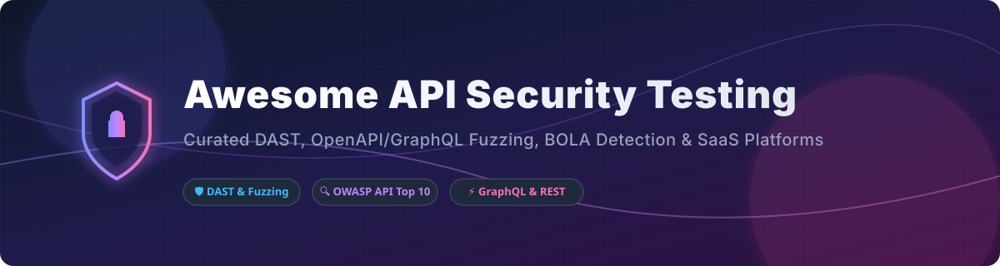

# 🛡️ Awesome API Security Testing 🚀

  
  
  
  
  

## 📌 Overview & Ecosystem Guide

Welcome to the **Awesome API Security Testing** ecosystem repository! This curated directory features top-tier **SaaS platforms** and **open-source GitHub projects** dedicated to **API security testing**, **API vulnerability scanning**, **OpenAPI / REST / GraphQL fuzzing**, **BOLA/BFLA detection**, **DAST for microservices**, and **continuous DevSecOps API protection**.

Whether you are performing security code audits, automated CI/CD pipeline scans, or runtime contract validation against the **OWASP API Security Top 10**, this list serves as your definitive guide to securing enterprise and modern web APIs.

---

## 📑 Table of Contents

- [☁️ SaaS / Hosted API Security Platforms](#%EF%B8%8F-saas--hosted-api-security-platforms)
- [🔓 Open-Source GitHub Projects](#-open-source-github-projects)
- [⚡ Quick Selection & CI/CD Pipeline Guide](#-quick-selection--cicd-pipeline-guide)
- [🤝 How to Contribute](#-how-to-contribute)
- [💖 Support & Sponsorship](#-support--sponsorship)
- [⚠️ Disclaimer](#%EF%B8%8F-disclaimer)
- [📈 Star History](#-star-history)

---

## ☁️ SaaS / Hosted API Security Platforms

> 💡 **Market Size & Structure**: The Global API Security Market size is estimated at **$1.1 Billion – $1.5 Billion** (2025–2026) and is projected to reach **$10+ Billion by 2033** (CAGR ~32%). The sector is **moderately fragmented**—featuring mega-security vendors (Palo Alto Networks), hyper-funded pure-play leaders (Salt, Traceable, Noname, Cequence), and agile specialist DAST/fuzzing platforms (Escape, StackHawk, 42Crunch, Akto).

*Sorted by Company Size / Valuation / Funding (Descending)* 📊

| 🏢 Platform | 📝 Key Focus & Features | 💰 Starting Price | 🎁 Free Tier / Free Trial Limits | 📊 Valuation / Funding / Market Cap |
| :--- | :--- | :--- | :--- | :--- |
| **[Noname Security](https://nonamesecurity.com/)** *(Acquired by Akamai)* | Complete API security posture management, enterprise API discovery, traffic analysis, and pre-production testing. | **$10,000 / year** (Enterprise quote min base) | **14-day free trial** (Full platform features, enterprise demo sandbox) | **$450 Million** *(Acquired for $450M by Akamai in 2024)* |
| **[Salt Security](https://salt.security/)** | AI-driven API discovery, continuous posture management, threat protection, and vulnerability testing. | **$15,000 / year** (Enterprise baseline) | **14-day free trial** (Guided proof-of-concept trial) | **$1.4 Billion** (Unicorn valuation, $270M+ raised) |
| **[Cequence Security](https://www.cequence.ai/)** | API protection platform offering API discovery, compliance risk audit, and bot management/threat prevention. | **$25,000 / year** (Unified API Protection platform) | **30-day free trial** (API Security Assessment trial) | **$800 Million** ($100M+ total funding raised) |
| **[Traceable AI](https://www.traceable.ai/)** | Context-aware API security, distributed tracing-based API discovery, attack protection, and dynamic testing. | **$500 / month** (Traceable Free/Team starter tier) | **Free Forever plan** (Up to 10 API endpoints monitored free) | **$500 Million** ($110M+ funding raised) |
| **[Data Theorem](https://www.datatheorem.com/)** | API Discover & Inspect, automated DAST scanning, continuous inventory across cloud and mobile APIs. | **$300 / month** (Per app / API asset module) | **14-day free trial** (Full scan audit for up to 5 endpoints) | **$300 Million** (Est. valuation, bootstrapped & profitable leader) |
| **[42Crunch](https://42crunch.com/)** | Developer-first API security platform for OpenAPI contract auditing, dynamic conformance testing, and API firewalls. | **$199 / month** (Developer / Team tier) | **Free Forever plan** (Unlimited OpenAPI Audit in VS Code/IDE; 25 API scans/mo) | **$100 Million** ($20M+ Series A funding) |
| **[Wallarm](https://www.wallarm.com/)** | End-to-end API security uniting API discovery, automated DAST API testing, and WAAP / API Threat Prevention. | **$500 / month** (Cloud tier base) | **14-day free trial** (Full Cloud WAAP and API scanner trial) | **$80 Million** ($18M+ funding raised) |
| **[StackHawk](https://www.stackhawk.com/)** | Developer-centric DAST and API security scanner powered by ZAP, built for CI/CD automation & OpenAPI testing. | **$49 / month** (Pro tier) | **Free Forever plan** (1 application / environment, unlimited scans) | **$65 Million** ($35M+ Series B funding) |
| **[Probely](https://probely.com/)** | Web and API vulnerability scanner with specialized OpenAPI and Postman collection DAST scanning engines. | **$99 / month** (Starter plan for 1 target) | **14-day free trial** (Full scan feature access for 1 target) | **$40 Million** ($12M+ funding raised) |
| **[Escape](https://escape.tech/)** | Agentless GraphQL and REST API Security platform utilizing automated business logic fuzzing and security posture analysis. | **$150 / month** (Developer / Startup tier) | **Free Forever plan** (Up to 3 API endpoints scanned, open spec audit) | **$25 Million** ($10M+ Series A funding) |
| **[Akto](https://www.akto.io/)** | Open-source & SaaS automated API security testing platform covering 100+ OWASP API vulnerability templates. | **$499 / month** (Growth plan) | **Free Forever plan** (Up to 100 API endpoints discovered and tested) | **$15 Million** ($4.5M+ Seed funding) |
| **[FireTail](https://firetail.ai/)** | Hybrid API security solution combining inline API code libraries, spec auditing, and dynamic security testing. | **$99 / month** (Pro tier) | **Free Forever plan** (Up to 500k API calls / month free) | **$10 Million** ($5M+ Seed funding) |

---

## 🔓 Open-Source GitHub Projects

*Sorted by GitHub Stars_Count (Descending)* 🌟

- **[mitmproxy/mitmproxy](https://github.com/mitmproxy/mitmproxy)**  
    
  🛠️ Interactive HTTPS proxy for intercepting, modifying, and replaying API requests. Essential for manual API security auditing, inspecting auth flows, and traffic analysis.

- **[projectdiscovery/nuclei](https://github.com/projectdiscovery/nuclei)**  
    
  ⚡ Fast and customizable vulnerability scanner powered by simple YAML templates. Includes extensive community templates targeting API vulnerabilities (BOLA/IDOR, JWT flaws, SSRF, GraphQL exposure).

- **[zaproxy/zaproxy](https://github.com/zaproxy/zaproxy)** *(OWASP ZAP)*  
    
  🛡️ World’s most widely used open-source DAST scanner. Fully supports OpenAPI/Swagger import, GraphQL introspection scanning, automated auth scripts, and headless CI integration.

- **[grafana/k6](https://github.com/grafana/k6)**  
    
  🔥 Modern developer-centric load testing tool written in Go and JavaScript. Widely extended for API rate-limiting validation, fault injection, and security performance testing.

- **[postmanlabs/newman](https://github.com/postmanlabs/newman)**  
    
  🚀 Command-line collection runner for Postman. Allows developers to execute automated API security test suites and assertions directly inside CI/CD pipelines.

- **[schemathesis/schemathesis](https://github.com/schemathesis/schemathesis)**  
    
  🧪 Powerful property-based testing tool for OpenAPI and GraphQL APIs. Generates negative test cases from specs, catching schema violations, unhandled server crashes, and edge-case bugs.

- **[microsoft/restler-fuzzer](https://github.com/microsoft/restler-fuzzer)**  
    
  🔬 Stateful REST API fuzzing engine developed by Microsoft Research. Automatically analyzes OpenAPI specs to infer producer-consumer payload dependencies and discover multi-step logic vulnerabilities.

- **[doyensec/inql](https://github.com/doyensec/inql)**  
    
  🔮 Advanced GraphQL security testing tool and Burp Suite extension for introspecting schema, auto-generating documentation, and discovering GraphQL queries/mutations vulnerabilities.

- **[wallarm/api-firewall](https://github.com/wallarm/api-firewall)**  
    
  🧱 High-performance proxy enforcing a positive security model by checking requests and responses against OpenAPI specs in real time.

- **[OWASP/www-project-api-security-testing-framework](https://github.com/OWASP/www-project-api-security-testing-framework)**  
    
  📖 Dedicated OWASP project creating structured guidelines, test suites, and automation rules mapped to the OWASP API Security Top 10 vulnerabilities.

---

## ⚡ Quick Selection & CI/CD Pipeline Guide

- 🤖 **Best for Automated CI/CD Pipelines**: Combine `zaproxy/zaproxy` (DAST scan) + `projectdiscovery/nuclei` (quick template regression) + `schemathesis` (contract fuzzing).
- 🧬 **Best for Complex Business Logic Fuzzing**: Use `microsoft/restler-fuzzer` for stateful multi-endpoint request flows.
- 📡 **Best for GraphQL Security**: Use `doyensec/inql` alongside `Escape` or `Schemathesis`.
- 🏢 **Best for Enterprise Inventory & Posture**: Utilize commercial pure-plays like `Salt Security`, `Noname Security`, or `Traceable AI`.

---

## 🤝 How to Contribute

Contributions are highly welcomed! Help us keep this directory up-to-date and complete:

1. Fork this repository.
2. Add your tool under the appropriate table or list with accurate, objective descriptions.
3. Verify all URLs and Stars_Badges format correctly.
4. Submit a Pull Request with a short summary of the addition.

---

## 💖 Support & Sponsorship

Thank you for using and supporting this awesome API security resource! If you find this repository helpful for your projects, security auditing, or DevSecOps workflow, please consider supporting the project:

- ⭐ **Star this repository** to help others discover it on GitHub.
- 🍴 **Fork & Share** it with your fellow security engineers and developers.
- ☕ **Buy Me a Coffee / Sponsor**: Support further open-source maintenance via the [GitHub Sponsor Dashboard](https://github.com/sponsors/ishandutta2007).

---

## ⚠️ Disclaimer

- This list is **community-curated** for educational, research, and defensive AppSec purposes only.
- Always obtain explicit permission before executing security scans, DAST tools, or fuzzers against any third-party API or production environment.

---

## 📈 Star History

---

  Maintained with ❤️ by <a href="https://github.com/ishandutta2007">Ishan Dutta</a> and AppSec contributors worldwide.

